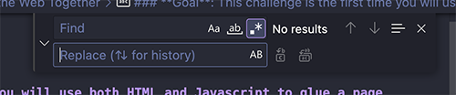
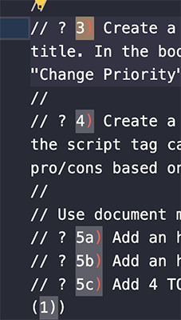
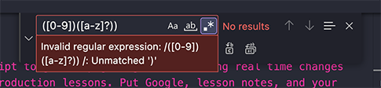
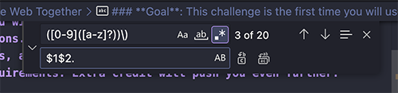

## VS Code Find & Replace + Regex

**Resources:**
- Regular Expressions (Regex) - https://developer.mozilla.org/en-US/docs/Web/JavaScript/Guide/Regular_expressions
- VS Code/Visual Studio Find & Replace - https://learn.microsoft.com/en-us/visualstudio/ide/finding-and-replacing-text?view=vs-2022&viewFallbackFrom=vs-2023

---

VS Code, Microsoft Word, and a variety of code/word editors off the ability to find and replace strings. Sometimes there are opportunities where multiple things were added that could use a global change or simply you're trying to find their location.

In this example I wrote the DOM challenge/homework in Javascript using comments initially. Code comments in most editor themes are displayed as grey reducing readability. In order to provide an improved & inclusive reading experience for you as developers I am reproducing an additional [Markdown](https://www.markdownguide.org/cheat-sheet/). Consider this when you think about the real world when producing your code for yourself and others. The experience you provide matters. Think about how you can make it as easy as possible on both of you how lessen the work to read and understand what is done or being asked of you.

This is about providing you, the learner, an easier way to read and understand the assignment. Both files provide the same information but one is much easier on the eyes. :)

Below you'll find a mini lesson on how I replaced the numbered comments to an acceptable format Markdown will render. See `units/web-apis/dom/challenge.js`. I duplicated this file and changed the extension from `.js` to `.md`. The find/replace was performed on the newly created Markdown file.

**JS Comments Version**: 1) Some step, 2) Some step

**Markdown Ordered List Format Needed**: 1. Some step, 2. Some step

---

### How can I solve this?!

How can I solve this without manually doing it? I can use both find/replace along w/ regex to make a singular global replacement this fle. Regular expressions (aka regex) is an expression library that provides tooling to search strings and eventually be paired w/ other tools to manipulate them. This has helped me immensely in my career including non-code things!

Seriously - it's saved my day many times. One time it fixed a major bug causing our customer Facebook from losing millions of dollars. Another time there was days of work asked of me by a product owner revising database information that was otherwise a manual process.

---

### What I Did

Deciding to create a Markdown (.md) file I needed my quick solution to save myself some the manual change pain. Knowing that I wrote it consistently as `{num}) ` (make sure to note the paren and space) I could capture it with regex and then use the replace feature to update it all at once.

**Steps**
- Identify and confirm the previously written syntax
- Enable regex on the Find/Replace
- Write the expression to target what I need
- Add to the expression a way to capture each number to later to replace the updated strings
- Review/test before running it
- Run it and feel good after

###

Open the file. Press Control (PC) or Command/Apple (Mac) + `f`` shortcut to display the find/replace in the top right of the file. After click the asterisk icon to the right of the `Aa`, `ab` icons.

**Note** - `Aa` = case sensitivity; `ab` underline = match whole word; asterisks = turn on regex

The first box is the same as a standard find EXCEPT it will now accept regex which is a series of characters allowing me to search for the string I want to eventually change. What are the pieces of that string?

**Pieces**: number, single parenthesis, single whitespace

I'll start by identifying a range of numbers using `[0-9]`. Next I'll add `)` and last a single space. Great start but we need more to make this come together.

---

### Special!

Some requirements have a substep using letters. After the `[0-9]` and before `)` I'm going to add another range `[a-z]`. This is matching the entire alphabet in lower case. So if I had `5a` I can now identify those specific ones. Not every requirement has the letter after the number. I can add `?` after the `[a-z]` to tell the expression it's optional. There's still a few needs and problems to address though!

If you've followed another so far VS Code is probably showing red noting it is an invalid expression. The problem is that the single paren at the end is a special character to regex. Instead of letting it think its part of the experession matching we need to say its literally the paren character.

Putting a backslash in front tells the expression to back off and just see it as a literal paren character. This is called an **escape**!

> `) ` becomes `\) `.

Last but not least! We need to store (knowing as capturing in regex) so that when we create our new string we have that data available. The way to capture is wrapping the expression or parts of it in parenthesis on each side.

> `[0-9]` becomes `([0-9])`

> `[a-z]?` becomes `([a-z]?)`

Captures are referenced later using the dollar symbol. Our numbers are match 1 which is the variable `$1`. The letters are are the `$2` variable.

###

## The End

> **Find Box Final Expression**: `([0-9])([a-z]?)\) `

> **Replacement Box Replacement String**: `$1$2. `

### **Readout**

*Find Box*
- Identify any number in the 0-9 range and store (aka capture) it.
- Same thing again but capture any lower case letter between a-z optionally.
- Identify a single parens but put the backslash (escaping) to tell the expression to look at is as a literal character. Parens mean something special to regex so we have to tell it to chill and be literal about the character.

*Replace Box*
- Access and use $1 variable (number)
- Access and use $2 variable (letter if was stored, remember it was optional)
- Literal single paren and whitespace character

###

# BAM!

Run it and all instances of the previous ordered list from JS comments is now a Markdown acceptable format. You can also do find/replace using regex globally! Just be careful. 👀